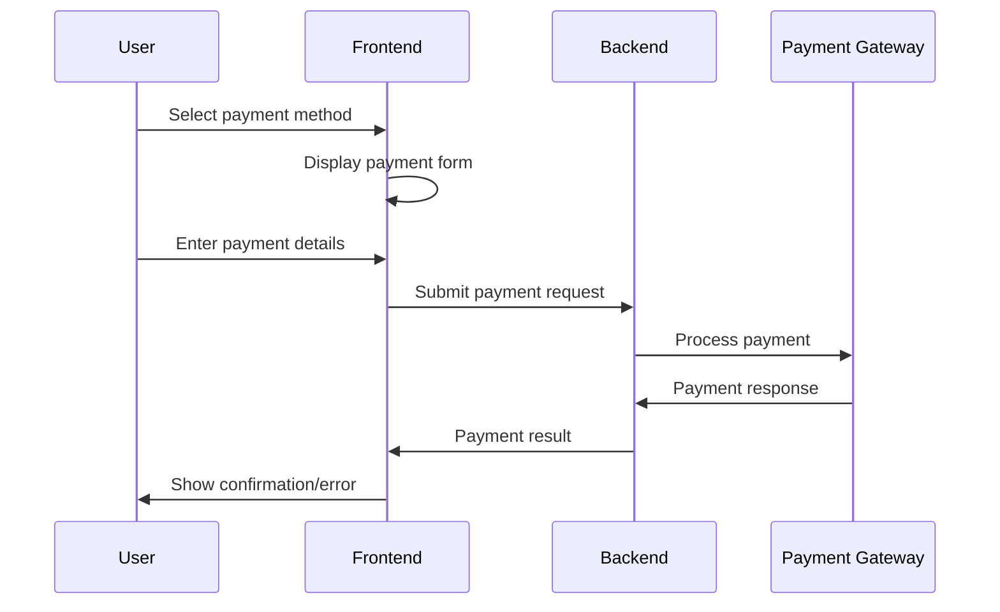

# Payment Gateway Integration Design

## Architecture Overview

### System Components

```
┌─────────────────┐    ┌──────────────────┐    ┌─────────────────┐
│   Frontend      │    │   Backend API    │    │  Payment        │
│   React App     │◄──►│   Node.js/       │◄──►│  Gateways       │
│                 │    │   Express        │    │                 │
└─────────────────┘    └──────────────────┘    └─────────────────┘
         │                       │                       │
         │                       │                       ├─ Stripe
         │                       │                       ├─ Chapa
         │                       │                       └─ Telebirr
         │                       │
         │              ┌──────────────────┐
         │              │   Database       │
         └──────────────┤   PostgreSQL     │
                        │                  │
                        └──────────────────┘
```

## Frontend Design

### Component Architecture

```
PaymentPage
├── PaymentMethodSelector
│   ├── StripeOption
│   ├── ChapaOption
│   └── TelebirrOption
├── PaymentForm
│   ├── StripeForm (Stripe Elements)
│   ├── MobileMoneyForm
│   └── BankTransferForm
├── PaymentSummary
└── SecurityNotice

ConfirmationPage
├── BookingSummary
├── QRCodeGenerator
├── DownloadTicket
└── NextSteps
```

### State Management

```typescript
interface PaymentState {
  selectedMethod: PaymentMethod | null
  paymentData: PaymentFormData
  processing: boolean
  error: string | null
  confirmation: PaymentConfirmation | null
}

interface PaymentMethod {
  id: string
  name: string
  type: 'card' | 'mobile_money' | 'bank_transfer'
  provider: 'stripe' | 'chapa' | 'telebirr'
  currencies: string[]
  countries: string[]
  fees: PaymentFees
}
```

### Payment Flow



## Backend Design

### API Endpoints

```typescript
// Payment processing
POST /api/payments/process
POST /api/payments/verify/:paymentId
GET /api/payments/methods
GET /api/payments/status/:paymentId

// Booking management
POST /api/bookings/create
GET /api/bookings/:bookingId
PUT /api/bookings/:bookingId/confirm

// Notifications
POST /api/notifications/email
POST /api/notifications/sms
```

### Service Layer

```typescript
class PaymentService {
  async processPayment(request: PaymentRequest): Promise<PaymentResponse>
  async verifyPayment(paymentId: string): Promise<PaymentStatus>
  async refundPayment(paymentId: string): Promise<RefundResponse>
  async getPaymentMethods(country: string): Promise<PaymentMethod[]>
}

class StripeService extends PaymentService {
  async createPaymentIntent(amount: number, currency: string): Promise<string>
  async confirmPayment(paymentIntentId: string): Promise<PaymentResult>
}

class ChapaService extends PaymentService {
  async initializePayment(request: ChapaRequest): Promise<ChapaResponse>
  async verifyTransaction(txRef: string): Promise<TransactionStatus>
}
```

### Database Schema

```sql
-- Payments table
CREATE TABLE payments (
    id UUID PRIMARY KEY DEFAULT gen_random_uuid(),
    booking_id UUID NOT NULL REFERENCES bookings(id),
    payment_method_id VARCHAR(50) NOT NULL,
    provider VARCHAR(20) NOT NULL,
    amount DECIMAL(10,2) NOT NULL,
    currency VARCHAR(3) NOT NULL,
    status VARCHAR(20) NOT NULL DEFAULT 'pending',
    gateway_payment_id VARCHAR(255),
    gateway_response JSONB,
    created_at TIMESTAMP DEFAULT NOW(),
    updated_at TIMESTAMP DEFAULT NOW()
);

-- Payment methods table
CREATE TABLE payment_methods (
    id VARCHAR(50) PRIMARY KEY,
    name VARCHAR(100) NOT NULL,
    provider VARCHAR(20) NOT NULL,
    type VARCHAR(20) NOT NULL,
    currencies TEXT[] NOT NULL,
    countries TEXT[] NOT NULL,
    is_active BOOLEAN DEFAULT true,
    configuration JSONB
);

-- Bookings table
CREATE TABLE bookings (
    id UUID PRIMARY KEY DEFAULT gen_random_uuid(),
    user_id UUID REFERENCES users(id),
    tour_id UUID NOT NULL,
    booking_reference VARCHAR(20) UNIQUE NOT NULL,
    total_amount DECIMAL(10,2) NOT NULL,
    currency VARCHAR(3) NOT NULL,
    status VARCHAR(20) NOT NULL DEFAULT 'pending',
    booking_data JSONB NOT NULL,
    created_at TIMESTAMP DEFAULT NOW(),
    updated_at TIMESTAMP DEFAULT NOW()
);
```

## Security Design

### Data Protection

```typescript
// Encryption for sensitive data
class EncryptionService {
  encrypt(data: string): string
  decrypt(encryptedData: string): string
  hash(password: string): string
  verifyHash(password: string, hash: string): boolean
}

// PCI DSS compliance measures
class PCIComplianceService {
  validateCardNumber(cardNumber: string): boolean
  tokenizeCard(cardData: CardData): string
  validatePCIEnvironment(): ComplianceReport
}
```

### Authentication & Authorization

```typescript
// JWT token validation
class AuthService {
  validateToken(token: string): Promise<User>
  generateToken(user: User): string
  refreshToken(refreshToken: string): string
}

// Role-based access control
enum PaymentPermissions {
  PROCESS_PAYMENT = 'payment:process',
  VIEW_PAYMENT = 'payment:view',
  REFUND_PAYMENT = 'payment:refund',
  ADMIN_PAYMENTS = 'payment:admin'
}
```

## Integration Patterns

### Stripe Integration

```typescript
class StripeIntegration {
  private stripe: Stripe
  
  async createPaymentIntent(request: PaymentRequest): Promise<PaymentIntent> {
    return await this.stripe.paymentIntents.create({
      amount: request.amount * 100, // Convert to cents
      currency: request.currency.toLowerCase(),
      metadata: {
        bookingId: request.bookingId,
        userId: request.userId
      }
    })
  }
  
  async confirmPayment(paymentIntentId: string): Promise<PaymentIntent> {
    return await this.stripe.paymentIntents.confirm(paymentIntentId)
  }
}
```

### Chapa Integration

```typescript
class ChapaIntegration {
  private apiKey: string
  private baseUrl: string
  
  async initializePayment(request: ChapaRequest): Promise<ChapaResponse> {
    const response = await fetch(`${this.baseUrl}/transaction/initialize`, {
      method: 'POST',
      headers: {
        'Authorization': `Bearer ${this.apiKey}`,
        'Content-Type': 'application/json'
      },
      body: JSON.stringify({
        amount: request.amount,
        currency: request.currency,
        email: request.email,
        tx_ref: request.txRef,
        callback_url: request.callbackUrl
      })
    })
    
    return await response.json()
  }
}
```

## Error Handling Strategy

### Error Types

```typescript
enum PaymentErrorType {
  INSUFFICIENT_FUNDS = 'insufficient_funds',
  INVALID_CARD = 'invalid_card',
  NETWORK_ERROR = 'network_error',
  GATEWAY_ERROR = 'gateway_error',
  VALIDATION_ERROR = 'validation_error',
  AUTHENTICATION_ERROR = 'authentication_error'
}

class PaymentError extends Error {
  constructor(
    public type: PaymentErrorType,
    public message: string,
    public code?: string,
    public retryable: boolean = false
  ) {
    super(message)
  }
}
```

### Retry Logic

```typescript
class RetryService {
  async executeWithRetry<T>(
    operation: () => Promise<T>,
    maxRetries: number = 3,
    backoffMs: number = 1000
  ): Promise<T> {
    for (let attempt = 1; attempt <= maxRetries; attempt++) {
      try {
        return await operation()
      } catch (error) {
        if (attempt === maxRetries || !this.isRetryable(error)) {
          throw error
        }
        await this.delay(backoffMs * Math.pow(2, attempt - 1))
      }
    }
    throw new Error('Max retries exceeded')
  }
}
```

## Performance Optimization

### Caching Strategy

```typescript
// Payment method caching
class PaymentMethodCache {
  private cache = new Map<string, PaymentMethod[]>()
  private ttl = 5 * 60 * 1000 // 5 minutes
  
  async getPaymentMethods(country: string): Promise<PaymentMethod[]> {
    const cached = this.cache.get(country)
    if (cached && this.isValid(cached)) {
      return cached
    }
    
    const methods = await this.fetchPaymentMethods(country)
    this.cache.set(country, methods)
    return methods
  }
}
```

### Database Optimization

```sql
-- Indexes for performance
CREATE INDEX idx_payments_booking_id ON payments(booking_id);
CREATE INDEX idx_payments_status ON payments(status);
CREATE INDEX idx_payments_created_at ON payments(created_at);
CREATE INDEX idx_bookings_reference ON bookings(booking_reference);
CREATE INDEX idx_bookings_user_id ON bookings(user_id);
```

## Monitoring & Observability

### Metrics Collection

```typescript
class PaymentMetrics {
  recordPaymentAttempt(method: string, amount: number): void
  recordPaymentSuccess(method: string, duration: number): void
  recordPaymentFailure(method: string, error: string): void
  recordGatewayLatency(provider: string, latency: number): void
}
```

### Logging Strategy

```typescript
class PaymentLogger {
  logPaymentRequest(request: PaymentRequest): void
  logPaymentResponse(response: PaymentResponse): void
  logError(error: PaymentError, context: any): void
  logSecurityEvent(event: SecurityEvent): void
}
```

## Testing Strategy

### Unit Tests

```typescript
describe('PaymentService', () => {
  it('should process stripe payment successfully', async () => {
    const mockStripe = createMockStripe()
    const service = new PaymentService(mockStripe)
    
    const result = await service.processPayment(mockPaymentRequest)
    
    expect(result.success).toBe(true)
    expect(result.paymentId).toBeDefined()
  })
})
```

### Integration Tests

```typescript
describe('Payment Integration', () => {
  it('should complete end-to-end payment flow', async () => {
    const response = await request(app)
      .post('/api/payments/process')
      .send(validPaymentRequest)
      .expect(200)
    
    expect(response.body.success).toBe(true)
    
    // Verify database state
    const payment = await Payment.findById(response.body.paymentId)
    expect(payment.status).toBe('completed')
  })
})
```

## Deployment Considerations

### Environment Configuration

```typescript
interface PaymentConfig {
  stripe: {
    publicKey: string
    secretKey: string
    webhookSecret: string
  }
  chapa: {
    publicKey: string
    secretKey: string
    baseUrl: string
  }
  telebirr: {
    apiKey: string
    baseUrl: string
  }
}
```

### Security Hardening

- SSL/TLS certificates for all endpoints
- API rate limiting and throttling
- Input validation and sanitization
- SQL injection prevention
- XSS protection headers
- CSRF token validation
- Regular security audits and penetration testing