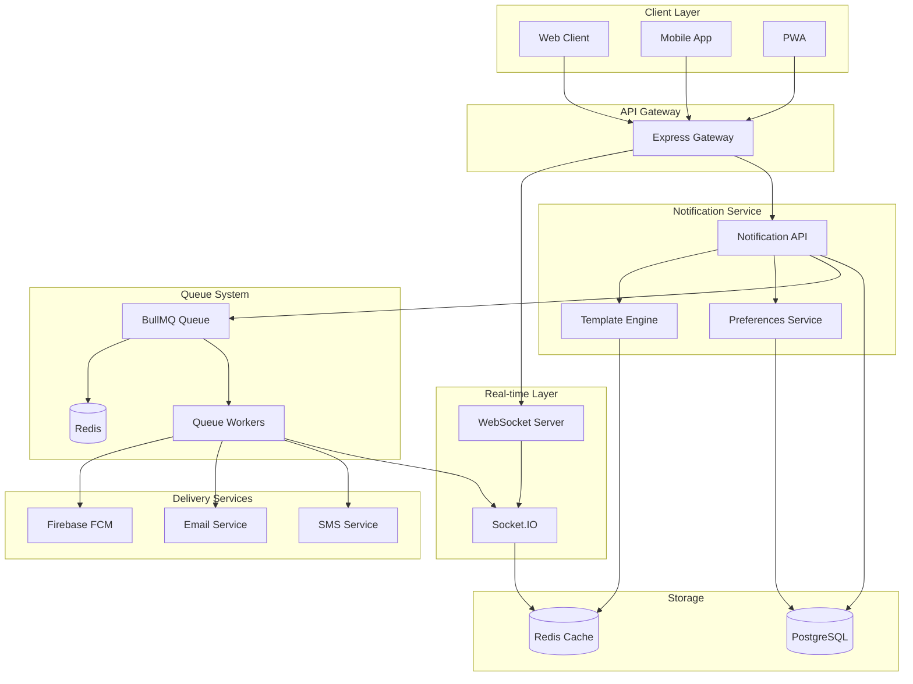

# Design Document: Real-time Notifications System

## Overview

The Real-time Notifications System provides instant, reliable notification delivery across multiple channels including in-app notifications, push notifications, and email. The system uses a microservices architecture with WebSocket connections for real-time delivery, message queues for reliability, and Firebase Cloud Messaging (FCM) for push notifications.

The system is designed to handle high volumes of notifications while maintaining low latency and ensuring delivery reliability through multiple fallback mechanisms.

## Architecture



## Components and Interfaces

### 1. Notification API Service

**Purpose**: Central service for creating, managing, and routing notifications

**Key Interfaces**:
```typescript
interface NotificationService {
  createNotification(notification: CreateNotificationRequest): Promise<Notification>
  getNotifications(userId: string, filters: NotificationFilters): Promise<Notification[]>
  markAsRead(notificationId: string, userId: string): Promise<void>
  updatePreferences(userId: string, preferences: NotificationPreferences): Promise<void>
  sendBroadcast(message: BroadcastMessage, audience: UserSegment): Promise<void>
}

interface CreateNotificationRequest {
  userId: string
  type: NotificationType
  title: string
  content: string
  data?: Record<string, any>
  channels: DeliveryChannel[]
  priority: NotificationPriority
  scheduledAt?: Date
}
```

### 2. Real-time Engine (WebSocket Service)

**Purpose**: Manages WebSocket connections and delivers real-time notifications

**Key Interfaces**:
```typescript
interface WebSocketService {
  handleConnection(socket: Socket): void
  authenticateUser(token: string): Promise<User>
  subscribeToChannel(userId: string, socket: Socket): void
  broadcastToUser(userId: string, notification: Notification): void
  handleDisconnection(socket: Socket): void
}

interface SocketEvents {
  'notification:new': (notification: Notification) => void
  'notification:read': (notificationId: string) => void
  'notification:bulk_read': (notificationIds: string[]) => void
  'user:online': (userId: string) => void
  'user:offline': (userId: string) => void
}
```

### 3. Push Notification Service

**Purpose**: Handles push notifications via Firebase Cloud Messaging

**Key Interfaces**:
```typescript
interface PushNotificationService {
  registerDevice(userId: string, deviceToken: string, platform: Platform): Promise<void>
  sendPushNotification(notification: PushNotification): Promise<PushResult>
  sendBatchNotifications(notifications: PushNotification[]): Promise<PushResult[]>
  unregisterDevice(deviceToken: string): Promise<void>
  cleanupInvalidTokens(): Promise<void>
}

interface PushNotification {
  deviceTokens: string[]
  title: string
  body: string
  data?: Record<string, string>
  imageUrl?: string
  actionButtons?: NotificationAction[]
}
```

### 4. Queue Management System

**Purpose**: Manages notification processing queues using BullMQ and Redis

**Key Interfaces**:
```typescript
interface QueueService {
  addNotificationJob(notification: NotificationJob): Promise<Job>
  addBatchJobs(notifications: NotificationJob[]): Promise<Job[]>
  processJob(job: Job): Promise<void>
  retryFailedJob(jobId: string): Promise<void>
  getQueueStats(): Promise<QueueStats>
}

interface NotificationJob {
  id: string
  type: NotificationType
  userId: string
  channels: DeliveryChannel[]
  payload: NotificationPayload
  priority: number
  delay?: number
  attempts?: number
}
```

### 5. Template Engine

**Purpose**: Manages notification templates and localization

**Key Interfaces**:
```typescript
interface TemplateService {
  renderTemplate(templateId: string, data: TemplateData, locale: string): Promise<RenderedTemplate>
  getTemplate(templateId: string, locale: string): Promise<NotificationTemplate>
  createTemplate(template: CreateTemplateRequest): Promise<NotificationTemplate>
  updateTemplate(templateId: string, updates: UpdateTemplateRequest): Promise<NotificationTemplate>
}

interface NotificationTemplate {
  id: string
  type: NotificationType
  locale: string
  title: string
  content: string
  emailSubject?: string
  pushTitle?: string
  pushBody?: string
  variables: TemplateVariable[]
}
```

## Data Models

### Core Notification Model
```typescript
interface Notification {
  id: string
  userId: string
  type: NotificationType
  title: string
  content: string
  data?: Record<string, any>
  channels: DeliveryChannel[]
  priority: NotificationPriority
  status: NotificationStatus
  readAt?: Date
  createdAt: Date
  updatedAt: Date
  scheduledAt?: Date
  expiresAt?: Date
}

enum NotificationType {
  BOOKING_CONFIRMATION = 'booking_confirmation',
  BOOKING_REMINDER = 'booking_reminder',
  BOOKING_CANCELLED = 'booking_cancelled',
  PAYMENT_SUCCESS = 'payment_success',
  PAYMENT_FAILED = 'payment_failed',
  CHAT_MESSAGE = 'chat_message',
  CHAT_MENTION = 'chat_mention',
  SYSTEM_ANNOUNCEMENT = 'system_announcement',
  SECURITY_ALERT = 'security_alert',
  PROMOTIONAL = 'promotional'
}

enum DeliveryChannel {
  IN_APP = 'in_app',
  PUSH = 'push',
  EMAIL = 'email',
  SMS = 'sms'
}

enum NotificationPriority {
  LOW = 1,
  NORMAL = 2,
  HIGH = 3,
  CRITICAL = 4
}
```

### User Preferences Model
```typescript
interface NotificationPreferences {
  userId: string
  channels: ChannelPreferences
  quietHours: QuietHours
  frequency: NotificationFrequency
  createdAt: Date
  updatedAt: Date
}

interface ChannelPreferences {
  [NotificationType.BOOKING_CONFIRMATION]: DeliveryChannel[]
  [NotificationType.BOOKING_REMINDER]: DeliveryChannel[]
  [NotificationType.PAYMENT_SUCCESS]: DeliveryChannel[]
  [NotificationType.CHAT_MESSAGE]: DeliveryChannel[]
  [NotificationType.SYSTEM_ANNOUNCEMENT]: DeliveryChannel[]
  // ... other notification types
}

interface QuietHours {
  enabled: boolean
  startTime: string // HH:mm format
  endTime: string   // HH:mm format
  timezone: string
  allowCritical: boolean
}
```

### Device Registration Model
```typescript
interface DeviceRegistration {
  id: string
  userId: string
  deviceToken: string
  platform: Platform
  appVersion: string
  isActive: boolean
  lastUsed: Date
  createdAt: Date
}

enum Platform {
  IOS = 'ios',
  ANDROID = 'android',
  WEB = 'web'
}
```

## Correctness Properties

*A property is a characteristic or behavior that should hold true across all valid executions of a system—essentially, a formal statement about what the system should do. Properties serve as the bridge between human-readable specifications and machine-verifiable correctness guarantees.*

Based on the prework analysis, the following properties have been identified as testable and will be implemented as property-based tests:

### Property 1: Event-driven notification creation
*For any* notification-worthy event, the system should create a notification record with correct timestamp, type, and content matching the event data.
**Validates: Requirements 1.1**

### Property 2: Preference-based channel selection
*For any* user preferences and notification type, the system should select delivery channels that match the user's enabled preferences for that notification type.
**Validates: Requirements 1.2, 4.5**

### Property 3: Notification queuing consistency
*For any* created notification, it should appear in the delivery queue with correct priority and scheduling information.
**Validates: Requirements 1.3**

### Property 4: Multi-type notification support
*For any* supported notification type (booking, payment, chat, system, promotional), the system should handle creation and processing correctly.
**Validates: Requirements 1.4**

### Property 5: Notification persistence with status
*For any* notification created, it should be persisted in the database with unread status and complete metadata.
**Validates: Requirements 1.5**

### Property 6: Real-time delivery for online users
*For any* online user and notification, the notification should be delivered immediately via WebSocket connection.
**Validates: Requirements 2.1**

### Property 7: WebSocket authentication and subscription
*For any* WebSocket connection establishment, the user should be authenticated and subscribed to their personal notification channel.
**Validates: Requirements 2.2**

### Property 8: Missed notification delivery on reconnection
*For any* user reconnection, all notifications created during their offline period should be delivered upon reconnection.
**Validates: Requirements 2.3**

### Property 9: WebSocket fallback to polling
*For any* WebSocket connection failure, the system should activate polling mechanism for notification delivery.
**Validates: Requirements 2.5**

### Property 10: Device token registration
*For any* push notification permission grant, the device token should be registered and associated with the user account.
**Validates: Requirements 3.1**

### Property 11: Platform-specific push formatting
*For any* push notification sent to different platforms (iOS, Android, Web), the message format should comply with platform-specific requirements.
**Validates: Requirements 3.2**

### Property 12: Offline push notification delivery
*For any* offline user with registered devices, notifications should be delivered via push notification to all active device tokens.
**Validates: Requirements 3.3**

### Property 13: Device token management
*For any* device token update or invalidation, the system should handle the change and maintain accurate device registrations.
**Validates: Requirements 3.4**

### Property 14: Push notification retry with exponential backoff
*For any* failed push notification, the system should retry with exponential backoff and log appropriate error information.
**Validates: Requirements 3.5**

### Property 15: Preference updates immediate application
*For any* user preference update, future notifications should immediately use the new preferences without requiring system restart.
**Validates: Requirements 4.3**

### Property 16: Quiet hours suppression
*For any* non-urgent notification during user-defined quiet hours, the notification should be suppressed or delayed until quiet hours end.
**Validates: Requirements 4.4**

### Property 17: Booking event notifications
*For any* booking creation or status change, appropriate notifications should be sent with correct booking details and status information.
**Validates: Requirements 5.1, 5.2**

### Property 18: Payment event notifications
*For any* payment processing (success or failure), immediate notifications should be sent with transaction details and appropriate next steps.
**Validates: Requirements 5.3, 5.4**

### Property 19: Scheduled booking reminders
*For any* booking approaching within 24 hours, reminder notifications should be sent with preparation details.
**Validates: Requirements 5.5**

### Property 20: Chat message notifications with content
*For any* new chat message, notifications should include sender name and message preview while respecting privacy settings.
**Validates: Requirements 6.1**

### Property 21: Chat mention priority notifications
*For any* user mention in group chat, high-priority notifications should be sent highlighting the mention context.
**Validates: Requirements 6.2**

### Property 22: Chat notification grouping
*For any* rapid sequence of chat messages, notifications should be grouped to prevent spam while maintaining message visibility.
**Validates: Requirements 6.3**

### Property 23: Active conversation suppression
*For any* chat notification when user is actively viewing the conversation, the notification should be suppressed to avoid redundancy.
**Validates: Requirements 6.4**

### Property 24: Support message priority
*For any* message from support staff, high-priority notifications should be sent with appropriate support context and urgency indicators.
**Validates: Requirements 6.5**

### Property 25: System announcement notifications
*For any* system maintenance, feature release, or security event, appropriate notifications should be sent with relevant details and timing.
**Validates: Requirements 7.1, 7.2, 7.3**

### Property 26: Broadcast notification delivery
*For any* broadcast notification sent to user segments, all users in the target segment should receive the notification.
**Validates: Requirements 7.4**

### Property 27: Emergency multi-channel delivery
*For any* critical system issue, emergency notifications should be sent through all available channels regardless of user preferences.
**Validates: Requirements 7.5**

### Property 28: Notification history completeness
*For any* notification sent to a user, it should be stored in their notification history with complete metadata and timestamps.
**Validates: Requirements 8.1, 8.2**

### Property 29: Read status tracking
*For any* notification marked as read, the read status and timestamp should be updated, and unread count should be decremented.
**Validates: Requirements 8.3**

### Property 30: Notification management operations
*For any* notification management action (mark read/unread, delete, bulk operations), the changes should be applied correctly and persistently.
**Validates: Requirements 8.4, 8.5**

### Property 31: Multi-language template selection
*For any* notification generation, the template should be selected based on user language preference and rendered with correct localization.
**Validates: Requirements 9.1**

### Property 32: Template dynamic content insertion
*For any* notification template with variables, dynamic content should be correctly inserted while maintaining template structure and formatting.
**Validates: Requirements 9.2**

### Property 33: Consistent branding across types
*For any* notification type generated, the branding and formatting should be consistent with the established design system.
**Validates: Requirements 9.3**

### Property 34: Rich content support
*For any* notification with rich content (images, links, buttons), the content should be rendered correctly across all delivery channels.
**Validates: Requirements 9.4**

### Property 35: Template versioning consistency
*For any* template change, queued notifications should use the template version that was active when they were created.
**Validates: Requirements 9.5**

### Property 36: Asynchronous processing non-blocking
*For any* notification processing operation, the main application operations should not be blocked or delayed.
**Validates: Requirements 10.1**

### Property 37: Rate limiting under high volume
*For any* high-volume notification scenario, rate limiting should be applied to prevent overwhelming external services while maintaining delivery.
**Validates: Requirements 10.2**

### Property 38: Notification batching efficiency
*For any* group of similar notifications, they should be batched when appropriate to improve delivery efficiency without compromising timeliness.
**Validates: Requirements 10.3**

### Property 39: Priority handling under load
*For any* high system load scenario, critical notifications should be prioritized over promotional notifications in processing and delivery.
**Validates: Requirements 10.5**

<function_calls>
<invoke name="prework">
<parameter name="featureName">real-time-notifications

## Error Handling

### 1. WebSocket Connection Errors
- **Connection Failures**: Implement automatic reconnection with exponential backoff
- **Authentication Errors**: Clear invalid tokens and redirect to login
- **Network Timeouts**: Fall back to HTTP polling for notification delivery
- **Message Delivery Failures**: Queue messages for retry when connection is restored

### 2. Push Notification Errors
- **Invalid Device Tokens**: Automatically remove invalid tokens from database
- **FCM Service Errors**: Implement retry logic with exponential backoff
- **Rate Limiting**: Respect FCM rate limits and queue notifications appropriately
- **Platform-Specific Errors**: Handle iOS/Android/Web specific error codes

### 3. Queue Processing Errors
- **Job Failures**: Implement retry mechanism with configurable attempts
- **Redis Connection Issues**: Graceful degradation with in-memory fallback
- **Worker Process Crashes**: Automatic worker restart and job recovery
- **Dead Letter Queue**: Move permanently failed jobs to dead letter queue for analysis

### 4. Template and Localization Errors
- **Missing Templates**: Fall back to default template with error logging
- **Variable Substitution Errors**: Use placeholder values and log missing variables
- **Localization Failures**: Fall back to default language (English)
- **Rich Content Errors**: Strip rich content and deliver plain text version

### 5. Database and Storage Errors
- **Connection Timeouts**: Implement connection pooling and retry logic
- **Constraint Violations**: Handle duplicate notifications gracefully
- **Storage Full**: Implement notification cleanup policies
- **Migration Errors**: Maintain backward compatibility during schema changes

## Testing Strategy

### Dual Testing Approach

The notification system requires both **unit tests** and **property-based tests** to ensure comprehensive coverage:

**Unit Tests** focus on:
- Specific notification scenarios and edge cases
- Integration points between services
- Error conditions and failure modes
- Template rendering with known data sets
- WebSocket connection handling
- Push notification formatting

**Property-Based Tests** focus on:
- Universal properties that hold across all notification types
- Comprehensive input coverage through randomization
- Correctness properties validation
- System behavior under various load conditions
- Data consistency across service boundaries

### Property-Based Testing Configuration

- **Testing Framework**: Use `fast-check` for TypeScript property-based testing
- **Test Iterations**: Minimum 100 iterations per property test
- **Test Tagging**: Each property test must reference its design document property
- **Tag Format**: `**Feature: real-time-notifications, Property {number}: {property_text}**`

### Testing Infrastructure

**Test Environment Setup**:
- Redis test instance for queue testing
- Mock FCM service for push notification testing
- WebSocket test server for real-time testing
- Test database with notification fixtures
- Mock external services (email, SMS)

**Performance Testing**:
- Load testing for high-volume notification scenarios
- WebSocket connection stress testing
- Queue processing performance benchmarks
- Database query optimization validation

**Integration Testing**:
- End-to-end notification delivery flows
- Cross-service communication validation
- External service integration testing
- Failover and recovery scenario testing

### Test Data Management

**Generators for Property Tests**:
- Random notification data generators
- User preference generators
- Device token generators
- Template data generators
- Event trigger generators

**Mock Services**:
- Mock FCM service with configurable responses
- Mock email service for testing
- Mock WebSocket clients for connection testing
- Mock Redis for queue testing

The testing strategy ensures that both specific examples work correctly (unit tests) and that universal properties hold across all possible inputs (property tests), providing comprehensive validation of the notification system's correctness and reliability.